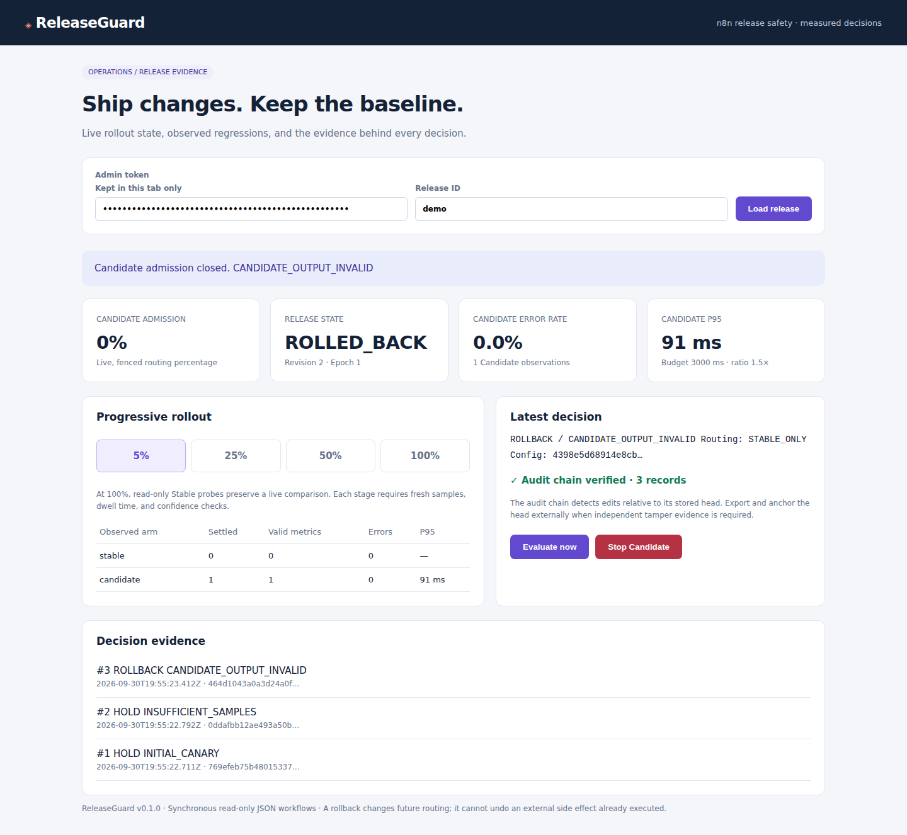

# ReleaseGuard for n8n

**Canary releases, evidence gates, and automatic rollback for production n8n workflows.**

ReleaseGuard protects **synchronous read-only JSON workflows** while a new version takes production traffic. Run Stable and Candidate side by side, route 5% → 25% → 50% → 100%, and make deterministic PROMOTE / HOLD / ROLLBACK decisions from measured executions.

A webhook returning HTTP 200 can still be a broken release. ReleaseGuard validates the output before returning it, retains the original Candidate failure when a fallback succeeds, and stops new Candidate admissions after a confirmed rollback.

## See the proof first

A tested rollback path looks like this:

`Candidate regression → ROLLBACK → Stable-only routing → evidence recorded → alert queued`

The repository exercises that behavior with real HTTP/PostgreSQL adversarial tests and real n8n production-webhook integration tests. The current standalone CI is green: [ReleaseGuard adversarial validation](https://github.com/achirothmane/releaseguard-n8n/actions/workflows/ci.yml).

ReleaseGuard is **not** a security scanner, backup tool, or random traffic splitter. It is a runtime release-control layer for deciding whether a Candidate should receive more traffic, hold at the current stage, or be removed from traffic.

## Choose your path

**Open-source core:** inspect the implementation, import the workflows, reproduce the tests, and run ReleaseGuard yourself.

**Production Pack — $39 one-time:** tested release bundle, rollout policy presets, deployment checklist, rollback drill, incident runbook, configuration examples, and release evidence.

**Get the Production Pack:** https://othmaneachir.gumroad.com/l/releaseguard-n8n-production?utm_source=github&utm_medium=readme&utm_campaign=releaseguard_n8n

## Practical guides

- [n8n canary deployment: roll out workflow changes gradually](docs/guides/n8n-canary-deployment.md)
- [n8n automatic rollback: stop a bad workflow release](docs/guides/n8n-automatic-rollback.md)
- [n8n production workflow safety: evidence before 100% traffic](docs/guides/n8n-production-workflow-safety.md)

## What you receive

- Importable Gateway, Stable, Candidate, and alert-receiver workflow JSON.
- A small Node service, PostgreSQL schema, Docker Compose, and an operations dashboard.
- Input contract checks before metrics, configurable stages, error budgets, relative/absolute p95 latency budgets, and JSON Schema and cross-field business output checks.
- A per-stage failure budget, minimum samples, 95% Wilson error-rate bounds, dwell time, and separate fresh confirmation batches.
- Atomic routing state + decision evidence + alert outbox; version and admission-revision fences.
- Safe read-only fallback, encrypted idempotent response replay, deadline-based observation loss, and evaluator lease expiry.
- Real HTTP/PostgreSQL adversarial tests and real n8n production-webhook tests. See [validation](docs/validation.md) for exactly what was executed.
- Setup guide, demo, independent product review, publishing copy, and actual screenshots generated by CI.

## Validation evidence

The original build passed 33 policy/security tests, 22 HTTP/PostgreSQL adversarial tests, and real n8n 2.41.4 production-webhook scenarios. The standalone CI repeats those checks after extraction; original evidence alone does not establish that the new repository passed. See [the original run](https://github.com/achirothmane/workflow-failure-lab/actions/runs/36768732791), the [standalone CI](https://github.com/achirothmane/releaseguard-n8n/actions/workflows/ci.yml), and [validation](docs/validation.md).

The evidence covers regression detection, invalid output, latency/error regressions, rollback, delayed rollback, stale tickets, duplicate requests, concurrent evaluators, observation loss, and other failure cases documented in the validation report. It does **not** prove universal production safety or compensate irreversible downstream side effects.

## Start

Requires Docker Compose, or Node 22 + PostgreSQL 16 + an existing n8n instance. The tested n8n target is 2.41.4. The dependency lockfile is committed; local installation, Docker builds, and CI use `npm ci`.

~~~sh
node scripts/generate-env.mjs
docker compose up -d --build
~~~

Open n8n at http://127.0.0.1:5678, create the owner account, import the four JSON files, configure the four credentials, and publish the workflows. Then:

~~~sh
npm ci
node --env-file=.env scripts/register.mjs
node --env-file=.env scripts/doctor.mjs
~~~

Open http://127.0.0.1:8080 to inspect the release. Follow [SETUP.md](docs/SETUP.md) for the complete installation and credential mapping.

## Suitable production use

Read-only enrichment, AI classification, extraction, normalization, scoring, and similar synchronous transformations **before** CRM writes, messages, or other irreversible operations. Send all protected traffic through the Gateway or the sidecar API. Stable and Candidate must have separate published production webhook URLs.

v0.1 supports one ReleaseGuard process per database. A PostgreSQL singleton lock rejects a second controller. State/observer failures can return HTTP 503. This favors bounded execution and honest failure over issuing Candidate work without a confirmed safe state.

## Decision semantics

| Decision | Effect |
|---|---|
| PROMOTE | Advance one stage. At 100%, a further evidence gate completes the release. |
| HOLD: samples / confidence / dwell / fresh batch / in flight | Keep the current canary percentage; never increase exposure. |
| HOLD: incomplete / stale / invalid metrics or bad Stable | Close Candidate admission and mark the release PAUSED. |
| ROLLBACK | Commit Stable-only routing, increment the revision, append evidence, and queue an alert atomically. |
| Rollback unconfirmed | Reject requests behind a local safety fence and report an incident; do not claim a successful rollback. |

At 100% Candidate traffic, 10% of read-only requests also run a Stable control probe by default. These probes cost additional n8n executions and can add response time. They make the live baseline observable instead of treating historical performance as current evidence.

## Tests

~~~sh
npm test
npm run check
DATABASE_URL=postgresql://... npm run test:integration
~~~

The real n8n suite requires the documented disposable CI environment; it creates its own n8n Docker container and never contacts external alert recipients.

## Product status and boundaries

This is a production-oriented release candidate for a controlled pilot, not a universal deployment or side-effect rollback system. It does not undo effects already executed, certify semantic correctness of LLM outputs, detect all workflow edits, provide HA, or prove market demand. The product review distinguishes shipped capabilities from deferred upgrades and commercial hypotheses.

See [PRODUCT-REVIEW.md](docs/PRODUCT-REVIEW.md), [DEMO.md](docs/DEMO.md), and [MARKETPLACE.md](docs/MARKETPLACE.md).

This standalone source is extracted from the verified Workflow Failure Lab build. See [EXTRACTION.md](docs/EXTRACTION.md) for the source commit, artifact digest, and the extraction-only changes. The active CI workflow is `.github/workflows/ci.yml`.

For production callers that can address the sidecar API directly, `/v1/execute/<release>` avoids an additional n8n Gateway execution. The n8n Gateway remains a tested optional ingress adapter.
